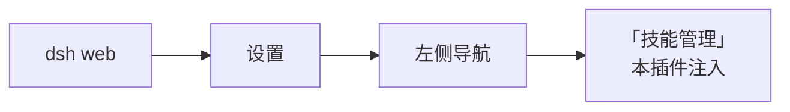
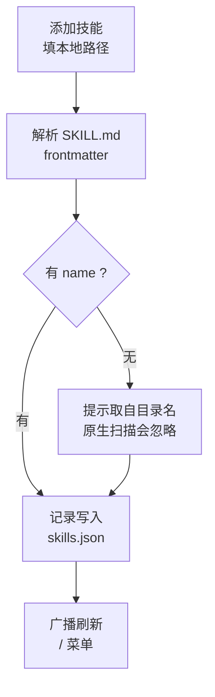

# dsh-skill-manager   

> 一句话定位：它把"手改 SKILL.md 和配置文件来管技能"变成网页设置里点几下就完成的操作，给手上有一堆自写技能、又不想每次翻目录改文件的人用。


| 项 | 改造前 | 改造后 |
| --- | --- | --- |
| 看全技能 | 逐个目录翻，靠记忆 | 设置页一处列全，并标出所在作用域层 |
| 临时不用某个技能 | 删文件夹或改名，下次还要改回来 | 一键关闭，**文件原封不动** |
| 登记一个已有技能 | 手动搬进某个目录 | 填本地路径即可，文件不用搬 |
| 改名字 / 改简介 | 手改 frontmatter，格式错了就不被识别 | 界面里改，安全写回 `SKILL.md` |
| 关掉后是否真关掉 | 只是界面不显示，模型还能调 | 逐层注册影子技能，真的不可调用 |
| `/` 菜单刷新 | 手动刷新页面 | 改完自动广播，菜单即时更新 |
| Windows 选技能 | 手打路径，容易打错 | 「选择文件…」弹系统对话框 |

## 适合谁 / 不适合谁

- 适合：如果你手上有一堆**自己写的技能散落在不同目录**、想在一个页面里看全；想**临时关掉某个技能**但不想删文件夹；写技能时**经常忘记 frontmatter 的 `name` / `description` 格式**导致 DSH 根本不识别；想把技能名和简介润色得更易认；或者**只想登记、不想搬运**技能文件。
- 不适合：如果你只装了一两个技能且从不调整——DSH 原生扫描已经够用；或者你想编辑技能的**正文逻辑**——本插件只管登记与元信息（名字/简介/开关），正文请用编辑器打开 `SKILL.md` 写。建议改用你自己的编辑器 + DSH 原生目录。
- 本插件**不做**：不复制、不移动、不删除你的技能文件；不改写正文内容；不管模型推理过程；对**链接（symlink）类型**的技能会拒绝改写。

## 安装

### 前置条件

| 项目 | 要求 | 说明 |
| --- | --- | --- |
| Node.js | **≥ 18** | DSH 自身的运行要求 |
| pnpm | 较新版本即可 | `dsh plugin` 的剩余参数会**原样转发给 pnpm**；缺它先 `npm i -g pnpm` |
| DSH | 已安装 `@deepseek-ai/dsh`，且能跑起 `dsh web` | 本插件的宿主。DSH（DeepSeek Harness）是一个**跑在你自己电脑上**的 AI 工作台，自带网页界面，可用插件扩展 |
| 技能文件 | 至少有一个技能目录（含 `SKILL.md`） | 没有技能也能装，但页面会是空的 |
| 操作系统 | Windows / macOS / Linux | 仅「选择文件…」对话框**仅 Windows** 可用；其他平台粘贴路径 |

### 该选哪种方式

| 方式 | 适用场景 | 代价 |
| --- | --- | --- |
| GitHub 直装 | 只想用，不改代码 | 更新可能滞后 |
| `link:` 本地开发 | 调试 / 改源码 / 提 PR | 需 Node + 构建环境 |
| Download ZIP | 离线 / 锁版本 | 不自动更新 |

<details><summary>方式一：GitHub 直装（推荐，完整步骤）</summary>

```bash
dsh plugin --profile web add github:xinshang777/dsh-skill-manager
```

安装成功后 `dsh plugin` 会把包登记进 profile 的 `dsh.profile.bundles`，**不需要手动改配置**。

</details>

<details><summary>方式二：link: 本地开发（改源码 / 提 PR 走这条）</summary>

```bash
git clone https://github.com/xinshang777/dsh-skill-manager.git
cd dsh-skill-manager
dsh plugin --profile web add link:.
```

改完 `lib/index.js`（宿主侧）或 `assets/client.js`（设置页 UI）后重启 `dsh web` 即生效。

</details>

<details><summary>方式三：Download ZIP（离线 / 锁版本）</summary>

1. 打开仓库页面 → **Code → Download ZIP**，解压到任意目录；
2. 在该目录执行 `dsh plugin --profile web add link:.`；
3. 重启 `dsh web`。

⚠️ 此方式不会自动更新，升级要重新下载。

</details>

### 重启说明

| 场景 | 是否需要重启 |
| --- | --- |
| 新装 / 卸载本插件 | ✅ 必须完整重启（本插件声明了 `"immediately": true`，属**启动即加载**） |
| 改 `~/.dsh/profiles/web/cordis.patch.yml` | ✅ 需要 |
| 改 `link:` 安装的插件源码 | ✅ 需要 |
| 登记 / 开关 / 改名 / 删除技能 | ❌ 不需要，改完自动广播刷新 `/` 菜单 |
| 设置里看不到「技能管理」页 | 先 **硬刷新**（`Ctrl + F5`），再确认是否完整重启过 |

> 💡 装了 [dsh-restart-button](https://github.com/xinshang777/dsh-restart-button) 的话，点界面上的重启按钮一步到位，不用回命令行。

### 三十秒验证成功

打开 `dsh web` → **设置** → 左侧看到 **「技能管理」** = 装好了。



如果没看到这一页，按顺序查三步：① `~/.dsh/profiles/web/package.json` 的 `dsh.profile.bundles` 数组里有没有 `dsh-skill-manager`；② 是否**完整重启**（本插件启动即加载，刷新页面不够）；③ 浏览器硬刷新。

## 使用教程

1. **进入页面** —— `dsh web` → **设置** → 左侧 **「技能管理」**。页面会列出当前所有技能，每条通常包含：**技能名**、**一句简介**、**所在层级**、**开关**。DSH 自带的内置技能默认隐藏，避免刷屏。
2. **登记一个已有的技能** —— 点「添加技能」→ 填技能路径：
   - **Windows**：点「选择文件…」弹系统对话框，直接选中该技能的 `SKILL.md`；
   - **其他平台**：在输入框直接粘贴路径（可以是技能**目录**，也可以是 `SKILL.md` 文件）。

   确认后插件会**解析 `SKILL.md` 的 frontmatter**，立刻告诉你"这是哪个技能"（名字、简介）；保存后记录写入 `~/.dsh/skill-manager/skills.json`。

   > 📌 **技能文件不会被复制或移动**。插件只记一个路径，所以你可以把技能仓库放在任何地方。
3. **开 / 关** —— 点某一条上的开关：**启用** = 技能出现在 `/` 菜单里、模型可以调用；**关闭** = 从 `/` 菜单消失、模型也无法调用，**文件保持不变**。
4. **改名字 / 改简介** —— 点「编辑」修改显示名与简介，保存时会**安全地写回** `SKILL.md` 的 frontmatter。
5. **删除登记** —— 点「删除」只删除**登记记录**，技能文件本身不受影响；想恢复就再登记一次。
6. **Windows 用户可点「选择文件…」** 直接用系统对话框挑 `SKILL.md`，不用手打路径。



**配置项**

本插件在 bundle 层**没有可配置项**（`cordis.patch.yml` 里没有任何 `config:`）。它的全部状态就是 `~/.dsh/skill-manager/skills.json` 里的一条条记录，字段如下（`lib/store.js` 的 `normalizeRecord` 定义）：

| 名称 | 类型 | 默认值 | 是否必填 | 作用 |
| --- | --- | --- | --- | --- |
| `slug` | string | — | **是** | 技能标识，必须是 **kebab-case**（如 `my-skill`），与 DSH 技能语法一致 |
| `enabled` | boolean | `true` | 否 | 是否启用（用户可调用）；关闭时逐层注册影子技能 |
| `managed` | boolean | `true` | 否 | 是否由本插件纳管 |
| `displayName` | string | 取自 frontmatter | 否 | 展示用名称 |
| `description` | string | 取自 frontmatter | 否 | 一句简介 |
| `target` | string | `"host"` | 否 | 目标作用域层 |
| `createdAt` | string | 写入时间 | 否 | 登记时间（ISO 8601） |

> 想手动修记录，直接编辑 `~/.dsh/skill-manager/skills.json` 即可——注意 `slug` 必须是 kebab-case。

## 常见问题 / 排障

**1｜设置里没有「技能管理」**

- **原因**：插件没挂载进 profile，或进程没重启，或页面是旧缓存。本插件声明了 `"immediately": true`，属**启动即加载**，光刷新页面不够。
- **处理**：① 确认 `~/.dsh/profiles/web/package.json` 的 `dsh.profile.bundles` 里有 `dsh-skill-manager`；② **完整重启** `dsh web`；③ 浏览器硬刷新 `Ctrl + F5`。

**2｜添加后 `/` 菜单里没出现**

- **原因**：DSH 原生扫描要求 `SKILL.md` 的 frontmatter **同时**有 `name` 和 `description`——**缺任何一个，整份文件会被直接忽略**。新手最常踩这个坑。
- **处理**：打开该技能的 `SKILL.md`，补上缺失的字段。本插件在添加时就会提示："技能名暂时取自目录名，DSH 原生扫描会忽略它，可以在添加时填上名称，会写回 `SKILL.md`"——照着提示在添加时补填即可。

**3｜关闭了技能，模型还是调用了**

- **原因**：技能名不匹配，或存在**运行期动态注册的第三方技能**——本插件的影子注册是在加载时逐层铺开的，运行期新注册的同名技能不受影响。
- **处理**：先确认是同一个技能名（`slug` 要与实际一致，kebab-case）；若有第三方插件在运行期动态注册技能，**重启 `dsh web`** 后再看。

<details><summary>完整排障表</summary>

| 现象 | 处理 |
| --- | --- |
| 设置里没有「技能管理」 | ① 确认 `bundles` 里有 `dsh-skill-manager`；② **完整重启**（`immediately: true`）；③ 硬刷新 `Ctrl + F5`。 |
| 添加后 `/` 菜单里没出现 | 检查 `SKILL.md` frontmatter 是否 `name` + `description` **都写了**——缺一个会被原生扫描忽略。 |
| 关闭了技能，模型还是调用了 | 先确认是同一个技能名；再看是否有运行期动态注册的同名技能，重启后再验证。 |
| 编辑名字/简介报错 | 该技能是**链接（symlink）**类型，插件拒绝改写目标仓库里的文件，请直接改源文件。 |
| 「选择文件…」点了没反应 | 该功能**仅 Windows** 可用；其他平台请在输入框粘贴路径。 |
| 记录丢了 / 想手动修 | 直接编辑 `~/.dsh/skill-manager/skills.json`（`slug` 必须是 kebab-case）。 |
| 某些技能在页面里看不到 | DSH 自带的内置技能默认隐藏，避免刷屏；这是刻意行为，不是读取失败。 |
| 整个文件读不出来 | 文件损坏时插件会**抛错而不是静默清空**——这是为了保护你攒的记录，请先备份再手工修 JSON。 |

</details>

## 兼容性与已知限制

- **宿主最低版本**：Node.js **≥ 18**；需要能跑起 `dsh web` 的 DSH（用到 `webServer.register`、`skills.register`、`agent-preset/selected` 事件等接口）。
- **平台差异**：核心功能跨平台一致；**唯一**平台差异是「选择文件…」对话框**仅 Windows**，其他平台改用粘贴路径。另外 symlink 类型的技能在**所有平台**都拒绝改写。
- **冲突插件**：未发现硬冲突。但需注意——如果**其他插件也在操作技能注册表**（例如自己实现技能开关），影子注册的 `rank: 250` 会与它比大小，可能出现"谁赢不一定"的情况；建议不要同时装两个管技能的插件。
- **已知限制**：只管元信息（名字 / 简介 / 开关），不管正文；影子注册对**运行期动态注册**的技能无效，需重启；数据层依赖 `skills.json` 单文件，没有多机同步。

## 升级、卸载与数据

- **配置存放位置**：`$DSH_HOME/skill-manager/skills.json`（默认 `~/.dsh/skill-manager/skills.json`）。技能文件本身仍在**你原来放的位置**，本插件不搬动它们。
- **升级**：
  - `github:` 方式：重跑一次 `dsh plugin --profile web add github:xinshang777/dsh-skill-manager`；
  - `link:` 方式：`git pull` 后重启 `dsh web`。
- **干净卸载**：
  ```bash
  dsh plugin --profile web remove dsh-skill-manager
  ```
  然后（可选）删除数据目录 `~/.dsh/skill-manager/`。
  ⚠️ **先知道再决定**：卸载后**影子注册会全部释放**，也就是说——之前被你"关闭"的技能会**恢复为可调用**。如果你希望它们保持关闭，卸载前请在 DSH 侧用其他方式处理，或保留本插件。插件不写注册表、不写系统目录。
- **回滚**：`link:` 方式 `git checkout <上一个 tag 或 commit>` 后重启；`github:` 方式换成旧 tag 重装。`skills.json` 与版本解耦，回滚不丢记录。

## 隐私

- **数据是否出本机**：**不出**。登记信息只写进本机 `~/.dsh/skill-manager/skills.json`，不上传任何内容。
- **是否联网**：插件**自身不发起外部请求**。所有接口挂在 `/dsh-skill-manager` 前缀下，并带回环（loopback）+ 同源（Origin）校验，跨站请求一律 403。
- **是否读取账号**：**不读**。不碰账号、不读客户端登录态。
- **需要知情的一点**：本插件会**读写你的 `SKILL.md` 文件**（解析 frontmatter、在改名/改简介时写回）。这是它的核心功能，但意味着它对技能文件有**写权限**；symlink 类型的技能被刻意排除在外。

## 实现原理（贡献者向）

<details><summary>挂钩点 · 数据流 · 接口表 · 目录结构</summary>

**挂钩点：`ctx.webServer.register()` + 技能注册表 + `agent-preset/selected`**

宿主侧通过 `ctx.webServer.register()` 挂路由，通过各目标层的 `skills.register()` 注册影子技能，并在改动后主动 `ctx.emit('agent-preset/selected', id, '')` 让前端失效重建缓存。

**数据层：一个文件就是全部状态**

`lib/store.js` 是**纯数据层**，只依赖 Node 内置模块（不 import 任何 `@deepseek-ai/*` 包），所以以 `link:` 方式安装时也能独立运行。数据落在 `$DSH_HOME/skill-manager/skills.json`（默认 `~/.dsh/skill-manager/skills.json`）。

两个稳健性设计：

- **单条脏数据只丢一行**——`normalizeRecord` 认不出来就返回 `null` 丢弃该行，而不是让整份文件失效；
- **文件损坏不静默清空**——文件存在但内容解析失败会**抛错**，避免把你辛苦攒的记录悄悄抹掉。

**影子注册：真正把技能"关掉"**

因为 DSH 的技能可能来自多个层（宿主层、agent-preset 层），而**每一层都可能各自有一份同名技能**。只"界面不显示"是没用的——`/` 菜单里那份还在，模型依然能调用。所以插件在每个目标层上都注册一个同名"影子"技能：

```js
// 伪代码：在每个目标层上注册同名影子
target.skills.register({
  name: slug,
  rank: 250,                                    // 压过用户/内置根
  invocation: { modelInvocable: false, userInvocable: false }
})
```

- 关闭**反向可逆**：重新启用时释放影子（`shadows.delete(slug)`），恢复原始定义；
- 组件卸载时遍历 `shadows` 全部释放，不留残影（这也是[卸载](#升级卸载与数据)那条约定的由来）。

**让 `/` 菜单立刻刷新**

浏览器把 `/` 菜单的技能目录**按会话缓存在页面里**，只有收到 `agent-preset/selected` 事件才会失效重建。所以插件在改动后主动发这个事件，页面无需手动刷新即可看到变化。

**接口表**

| 方法 | 路径 | 用途 |
| --- | --- | --- |
| `GET` / `HEAD` | `/dsh-skill-manager/list` | 列出全部技能及生效状态（非 GET/HEAD 直接拒绝） |
| `POST` | `/dsh-skill-manager/add` | 登记一个技能路径 |
| `POST` | `/dsh-skill-manager/toggle` | 切换启用状态（内部走影子注册 / 释放） |
| `POST` | `/dsh-skill-manager/update` | 改名 / 改简介（写回 frontmatter） |
| `POST` | `/dsh-skill-manager/delete` | 删除登记记录 |
| `POST` | `/dsh-skill-manager/inspect` | 只解析一个路径的 `SKILL.md`，用于添加前预览 |
| `POST` | `/dsh-skill-manager/pick-file` | 唤起系统「选择文件」对话框（**仅 Windows**） |

**数据流**

```
设置页操作
  ├─ add / inspect  → 解析 SKILL.md frontmatter → 写 skills.json
  ├─ toggle         → 逐层 skills.register(影子, rank 250) 或 shadows.delete
  ├─ update         → 安全写回 SKILL.md frontmatter
  └─ delete         → 只删登记记录
→ 广播 agent-preset/selected → / 菜单失效重建
```

**目录结构**

```text
dsh-skill-manager/
├── lib/
│   ├── index.js     # 宿主侧：webServer 路由、影子注册、frontmatter 解析、状态广播
│   └── store.js     # 数据层：skills.json 读写与规范化（零 @deepseek-ai 依赖）
├── assets/client.js # 浏览器侧：设置页 UI
├── cordis.patch.yml # bundle 挂载声明
└── package.json
```

</details>

详见 `docs/architecture.md`

## 贡献与反馈

[CONTRIBUTING.md](CONTRIBUTING.md) · [CHANGELOG.md](CHANGELOG.md) · Issue 模板

改数据层字段时请同步更新 `lib/store.js` 的 `normalizeRecord` 与本文档的配置项表，避免文档与实现脱节。

## 许可证

MIT — 见 [LICENSE](LICENSE)
