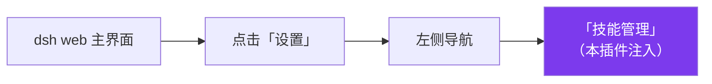

<div align="center">

# dsh-skill-manager

**给 DSH 补上一个「技能管理」页面** —— 用图形界面登记、开关、改名、删除你的技能，
不用再手改 `SKILL.md` 和配置文件。

[](LICENSE)
[](https://github.com/deepseek-ai/deepseek-harness)
[](#三安装)

</div>

---

## 先花 30 秒搞懂它是什么

| 名词 | 白话解释 |
|---|---|
| **DSH** | DeepSeek Harness（npm 包 `@deepseek-ai/dsh`），**跑在你自己电脑上**的 AI 工作台，自带网页界面。 |
| **技能（Skill）** | 一个文件夹，里面放一份 `SKILL.md`，写着"遇到 X 类任务时该怎么做"。DSH 会在对话中按需调用它。 |
| **本插件** | 一个 DSH 插件。装上后，**设置里会多出一个「技能管理」页**，让你用点击代替手动编辑文件。 |

**如果你现在的做法是**：手动把技能文件夹丢进某个目录 → 手动改 `SKILL.md` 的 frontmatter → 重启 → 发现没生效 → 再猜哪里写错了……
那么本插件就是为你准备的。

---

## 一、适用范围（谁该用它）

**适合你，如果：**

- 你手上有**一堆自己写的技能**，散落在不同目录，想在一个页面里看全；
- 你想**临时关掉某个技能**，但不想把文件夹删掉或改文件名（下次还要用）；
- 你写技能时**经常忘记 frontmatter 的 `name` / `description` 格式**，导致 DSH 根本不识别它；
- 你想把某个技能的**名字或简介润色一下**，让它在 `/` 菜单里更好认；
- 你**只想登记、不想搬运**——技能文件夹留在原地，用路径引用即可。

**不适合你，如果：**

- 你只装了一两个技能且从不调整——DSH 原生扫描已经够用；
- 你想编辑技能的**正文逻辑**——本插件只管登记和元信息（名字/简介/开关），正文请用编辑器打开 `SKILL.md` 写。

---

## 二、它能做什么（通俗版）

一句话：**它是技能的"控制面板"。**

| 能力 | 说明 |
|---|---|
| 📋 **列全** | 一处看到所有技能，并区分它们所在的作用域层（宿主层 / agent-preset 层）。DSH 自带的内置技能默认隐藏，避免刷屏。 |
| ➕ **登记** | 填一个**本地路径**（技能目录或直接指向 `SKILL.md`）就能把它纳管，记录写入配置文件。**文件不用搬**。 |
| 🔛 **开关** | 一键切换某个技能的「用户可调用」状态。关掉后在 `/` 菜单里就看不见它了，但文件原封不动。 |
| ✏️ **改名/改简介** | 直接改显示名和一句简介，会**安全地写回** `SKILL.md` 的 frontmatter。 |
| 🗑️ **删除** | 删除的只是**登记记录**，不会碰你的技能文件。 |
| 🪟 **选文件（Windows）** | 点按钮弹系统「选择文件」对话框，直接挑 `SKILL.md`，不用手打路径。 |
| 🔄 **自动刷新** | 改完立刻通知会话刷新 `/` 菜单的技能目录，**不用手动刷新页面**。 |

### 为什么"关掉技能"不是简单藏起来？

因为 DSH 的技能可能来自多个层（宿主层、agent-preset 层），而**每一层都可能各自有一份同名技能**。
如果只是"在界面上不显示"，`/` 菜单里那份还在，模型依然能调用——那就等于没关掉。

本插件的做法是：**在每个目标层上都注册一个同名"影子"技能**，把它的
`modelInvocable` 和 `userInvocable` 都设为 `false`，并用更高的 `rank` 压过原始定义。
于是无论从哪一层解析，这个技能名都是"不可调用"的——**这才是真的关掉**。

---

## 三、安装

### 前置条件

| 项 | 要求 |
|---|---|
| Node.js | 18 或更高 |
| pnpm | `npm i -g pnpm` |
| DSH | `npm i -g @deepseek-ai/dsh`，装完能跑起 `dsh web` |

### 方式 A：直接从 GitHub 安装（推荐）

```bash
dsh plugin --profile web add github:xinshang777/dsh-skill-manager
```

### 方式 B：克隆到本地再以链接方式安装（想改代码时用）

```bash
git clone https://github.com/xinshang777/dsh-skill-manager.git
cd dsh-skill-manager
dsh plugin --profile web add link:.
```

### 方式 C：只想下载

仓库页面 → **Code** → **Download ZIP**。

### 安装后必须重启

```bash
# 停掉 dsh web（Ctrl + C），然后
dsh web
```

> 💡 装了 [dsh-restart-button](https://github.com/xinshang777/dsh-restart-button) 的话，点界面上的按钮即可重启。

### 重启后没看到「技能管理」？检查这一处

`dsh plugin add` 安装成功后**会自动**把插件登记进 profile 的 `dsh.profile.bundles`，正常无需手动改配置。

若重启后设置里没有这一页，打开 `~/.dsh/profiles/web/package.json`，确认 `dsh.profile.bundles` 里有 `dsh-skill-manager`：

```jsonc
{
  "dsh": {
    "profile": {
      "bundles": [
        "@deepseek-ai/dsh-base",
        "@deepseek-ai/dsh-web-app",
        "dsh-skill-manager"      // ← 有这一项才算已挂载
      ]
    }
  }
}
```

没有就手动补上并重启。另外本插件声明了 `"immediately": true`，属于**启动即加载**的客户端插件，
所以必须完整重启进程才会出现。

---

## 四、使用教程

### 第 1 步：进入页面

`dsh web` → 打开 **设置** → 左侧找到 **「技能管理」**。



页面会列出当前所有技能。每一条通常包含：**技能名**、**一句简介**、**所在层级**、**开关**。

### 第 2 步：登记一个已有的技能

1. 点 **「添加技能」**；
2. 填写技能路径：
   - **Windows**：点 **「选择文件…」** 弹出系统对话框，直接选中该技能的 `SKILL.md`；
   - **其他平台**：在输入框直接**粘贴路径**（可以是技能**目录**，也可以是 `SKILL.md` 文件）；
3. 确认后，插件会**解析 `SKILL.md` 的 frontmatter**，立刻告诉你"这是哪个技能"（名字、简介）；
4. 保存 → 记录写入 `~/.dsh/skill-manager/skills.json`。

> 📌 **技能文件不会被复制或移动**。插件只记一个路径，所以你可以把技能仓库放在任何地方。

### 第 3 步：开 / 关

点某一条上的开关即可：

| 状态 | 效果 |
|---|---|
| **启用** | 技能出现在 `/` 菜单里，模型可以调用 |
| **关闭** | 从 `/` 菜单消失，模型也无法调用；**文件保持不变** |

### 第 4 步：改名字 / 改简介

点 **编辑**，修改「显示名」和「简介」。保存时会写回 `SKILL.md` 的 frontmatter。

> ⚠️ **链接（symlink）类型的技能会拒绝改写**——因为改写的可能是别人的仓库，插件选择不越界。

### 第 5 步：删除登记

点 **删除** → 只删除**登记记录**，技能文件本身不受影响。想恢复就再登记一次。

---

## 五、实现原理

### 数据层：一个文件就是全部状态

`lib/store.js` 是**纯数据层**，只依赖 Node 内置模块（不 import 任何 `@deepseek-ai/*` 包），
所以以 `link:` 方式安装时也能独立运行。数据落在：

```
$DSH_HOME/skill-manager/skills.json
# 默认 ~/.dsh/skill-manager/skills.json
```

单条记录的形状（`lib/store.js` 的 `normalizeRecord`）：

```jsonc
{
  "slug": "my-skill",          // 必须是 kebab-case，与 dsh-skill 的语法一致
  "enabled": true,             // 是否启用（用户可调用）
  "managed": true,             // 是否由本插件纳管
  "displayName": "我的技能",    // 展示用名称
  "description": "一句简介",
  "target": "host",            // 目标作用域层
  "createdAt": "2026-09-26T..."
}
```

两个稳健性设计：

- **单条脏数据只丢一行**——`normalizeRecord` 认不出来就返回 `null` 丢弃该行，而不是让整份文件失效；
- **文件损坏不静默清空**——文件存在但内容解析失败会**抛错**，避免把你辛苦攒的记录悄悄抹掉。

### 影子注册：真正把技能"关掉"

```js
// 伪代码：在每个目标层上注册同名影子
target.skills.register({
  name: slug,
  rank: 250,                                    // 压过用户/内置根
  invocation: { modelInvocable: false, userInvocable: false }
})
```

- 关闭**反向可逆**：重新启用时会释放影子（`shadows.delete(slug)`），恢复原始定义；
- 组件卸载时会遍历 `shadows` 全部释放，不留残影。

### 让 `/` 菜单立刻刷新

浏览器把 `/` 菜单的技能目录**按会话缓存在页面里**，只有收到 `agent-preset/selected` 事件才会失效重建。
所以插件在改动后主动 `ctx.emit('agent-preset/selected', id, '')`，页面无需手动刷新即可看到变化。

### HTTP 接口

全部挂在 `/dsh-skill-manager` 前缀下，都由 `ctx.webServer.register()` 注册：

| 方法 | 路径 | 用途 |
|---|---|---|
| `GET` / `HEAD` | `/dsh-skill-manager/list` | 列出全部技能及生效状态（非 GET/HEAD 直接拒绝） |
| `POST` | `/dsh-skill-manager/add` | 登记一个技能路径 |
| `POST` | `/dsh-skill-manager/toggle` | 切换启用状态（内部走影子注册/释放） |
| `POST` | `/dsh-skill-manager/update` | 改名 / 改简介（写回 frontmatter） |
| `POST` | `/dsh-skill-manager/delete` | 删除登记记录 |
| `POST` | `/dsh-skill-manager/inspect` | 只解析一个路径的 `SKILL.md`，用于添加前预览 |
| `POST` | `/dsh-skill-manager/pick-file` | 唤起系统「选择文件」对话框（仅 Windows） |

所有接口都带回环（loopback）+ 同源（Origin）校验，跨站请求一律 403。

### 一个值得知道的坑

DSH 的原生扫描要求 `SKILL.md` 的 frontmatter **同时**有 `name` 和 `description`——
**缺任何一个，整份文件会被直接忽略**。所以本插件在添加时会解析 frontmatter，
如果发现只有目录名、没有 `name`，会明确提示你："技能名暂时取自目录名，DSH 原生扫描会忽略它，
可以在添加时填上名称，会写回 `SKILL.md`"。这正是新手最常踩的坑。

### 目录结构

```text
dsh-skill-manager/
├── lib/
│   ├── index.js    # 宿主侧：webServer 路由、影子注册、frontmatter 解析、状态广播
│   └── store.js    # 数据层：skills.json 读写与规范化（零 @deepseek-ai 依赖）
├── assets/client.js # 浏览器侧：设置页 UI
├── cordis.patch.yml # bundle 挂载声明
└── package.json
```

---

## 六、常见问题

| 现象 | 原因 / 处理 |
|---|---|
| 设置里没有「技能管理」 | ① 确认 `bundles` 里有 `dsh-skill-manager`；② **完整重启**，本插件是启动即加载（`immediately: true`）；③ 硬刷新（`Ctrl + F5`）。 |
| 添加后 `/` 菜单里没出现 | 检查该技能的 `SKILL.md` frontmatter 是否 `name` + `description` **都写了**——缺一个会被原生扫描忽略。 |
| 关闭了技能，模型还是调用了 | 先确认是同一个技能名；再检查是否有多个层各有一份同名定义（本插件会逐层注册影子，但若是运行期动态注册的第三方技能，需要重启后再看）。 |
| 编辑名字/简介报错 | 该技能是**链接（symlink）**类型，插件拒绝改写目标仓库里的文件。请直接改源文件。 |
| 「选择文件…」点了没反应 | 该功能**仅 Windows** 可用；其他平台请在输入框粘贴路径。 |
| 记录丢了 / 想手动修 | 直接编辑 `~/.dsh/skill-manager/skills.json`（注意 `slug` 必须是 kebab-case，如 `my-skill`）。 |

---

## License

[MIT](LICENSE)
